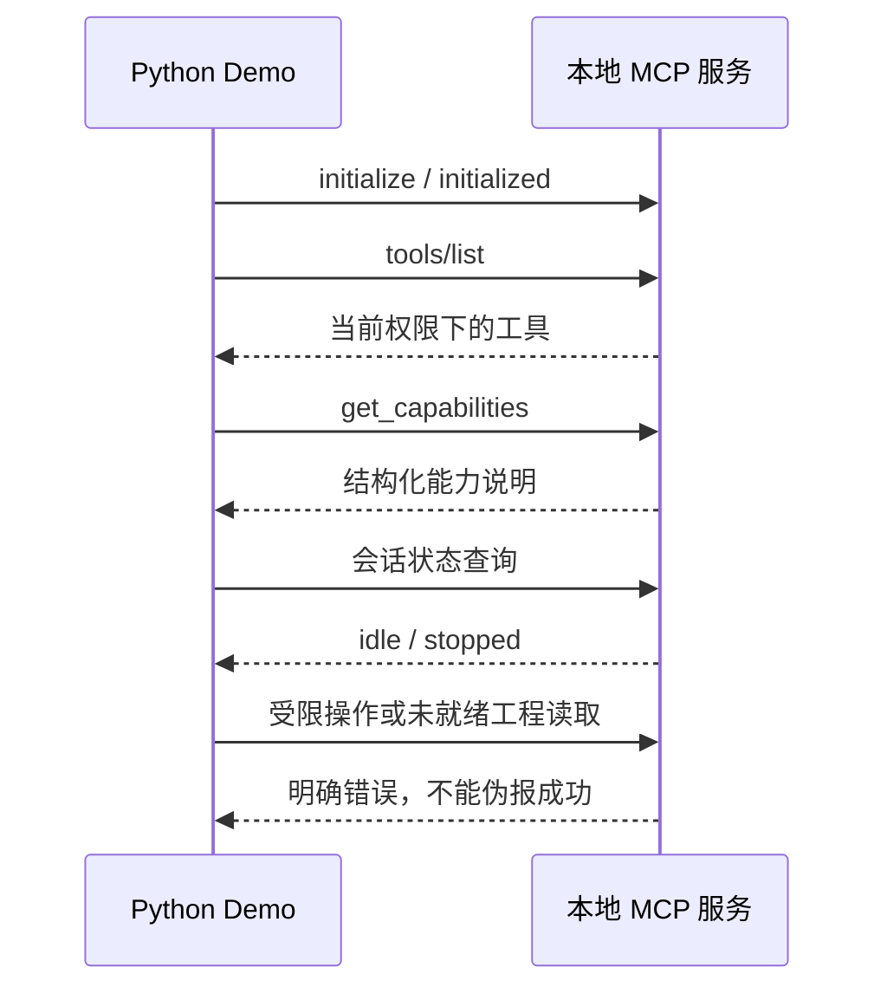

# 可运行 Demo：InoProShop MCP

本示例启动仓库构建出的真实 MCP 服务，通过 stdio JSON-RPC 演示握手、工具发现、能力查询、只读限制和明确失败响应。不是预录响应或模拟 PLC。

## 一键演示

Python 3.10+、Node.js 18+。这个协议 Demo 不需要安装 InoProShop；脚本传入 Node 路径仅满足配置校验，同时固定禁用自动启动。不要将这份演示配置用于真实工程。

在仓库根目录执行：

```powershell
npm ci --ignore-scripts
npm run build
python -X utf8 demos/run_demo.py
```

成功以 `DONE` 结束，失败返回非零退出码。脚本只使用 Python 标准库，创建独立临时状态目录并关闭自己启动的服务，不读取现有会话状态。

## 看演示结果

[完整实测终端输出](expected-output.txt)。工具数量会随版本变化；此文件由本次真实执行生成。



## 配合 AI 的提示词

> 请先查看 MCP 能力和当前状态，再列出当前可用工具。不要启动 IDE、打开工程或连接 PLC。指出哪些工程操作当前不可用，并依据实际返回值回答。

## 安装厂商软件后的工程演示路线

1. 配置真实 exe、Profile 和工作区，显式启动 IDE、打开测试工程。
2. `get_project_structure` 获取精确 POU 路径，`get_pou_code` 读取内容与 hash。
3. 为全部待修改对象逐一调用 `set_pou_code`，每次携带对应 expectedHash 并检查写后读回结果；此接口不提供跨对象原子事务。
4. 完整代码全部写入后，调用一次 `compile_project` 编译整个应用。不要逐块写入后逐块编译。
5. 检查结构化诊断，集中修复后再次完整写入，再整应用编译。

真实配置参见 [MCP 配置](../README.md#mcp-配置)，验收参见 [VALIDATION.md](../VALIDATION.md)。这个离线 Demo 不执行上述工程操作。

若写入超时，先查询命令状态，不自动重发。以上演示不包含控制器下载、RUN/STOP 或实体设备动作，也不代表设备验收完成。
